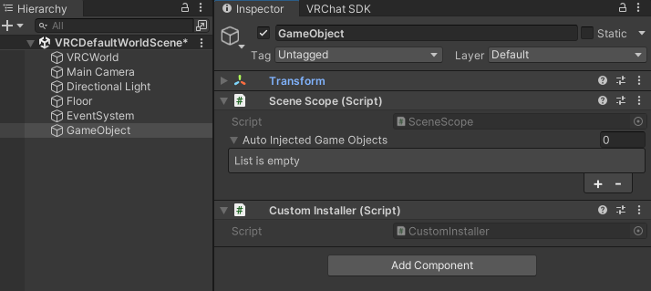
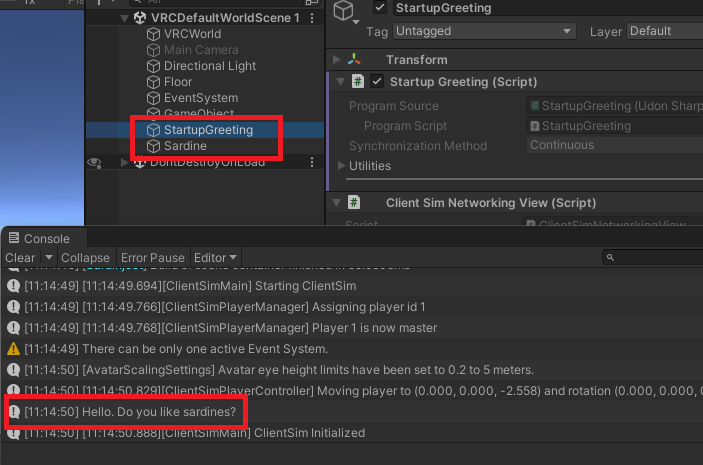

# 基本的な使い方

ここでは簡単な依存関係を作ってみます。

### 必要なスクリプトを用意する

呼び出されると文字列を出力する `Hello()` メソッドを持つ `Sardine` クラスを定義します。

```csharp
public class Sardine : UdonSharpBehaviour {
  public void Hello() {
    Debug.Log($"Hello. Do you like sardines?");
  }
}
```

起動すると `Sardine` クラスの `Hello()` メソッドを呼び出す `StartupGreeting` クラスを定義します。

```csharp
public class StartupGreeting : UdonSharpBehaviour {
  [Inject, SerializeField, HideInInspector]
  Sardine sardine;

  private void Start() {
    sardine.Hello();
  }
}
```

### 依存関係を記述したスクリプトを用意する

依存関係は明示的に定義しておく必要があります。  
以下のようなスクリプトに依存関係を記述します。

```csharp
public class CustomInstaller : MonoBehaviour, IInstaller {
  public void Install(ContainerBuilder builder) {
    builder.RegisterComponentOnNewGameObject<Sardine>(Lifetime.Cached);
    builder.RegisterEntryPoint<StartupGreeting>(Lifetime.Cached);
  }
}
```

### 依存関係を設定する

シーン上にゲームオブジェクトを作成します。  
作成したオブジェクトに `SceneScope` コンポーネントと先ほど作成した `CustomInstaller` コンポーネントを追加します。  



### 実行してみる

設定が終わったらプレイモードに切り替えて実行してみます。  



実行が開始されると自動的に作成したスクリプトがシーン上に生成されコンソールに文字列が出力されることを確認できます。
