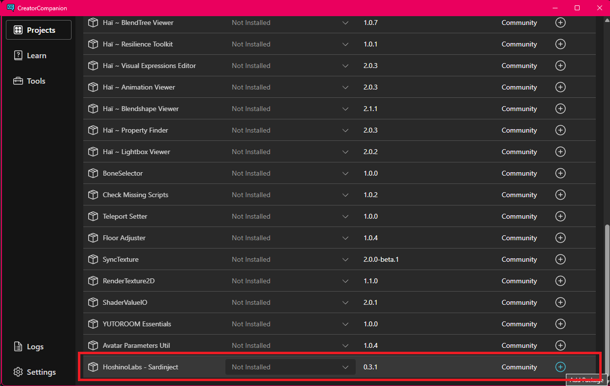

# インストール

*Unity 2022.3+ が必要です*

### VCC を利用したインストール

1. 次のリンクをクリックして VCC へインストールします。 
  [VCC へ追加](vcc://vpm/addRepo?url=https://vpm.hoshinolabs.com/vpm.json)
2. VCCので "Manage Project" を押す。
3. `HoshinoLabs - Sardinject` の横の "+" ボタンをして下さい。
  

### Install commandline (using VPM CLI)

```bash
vpm add repo https://vpm.hoshinolabs.com/vpm.json
cd /your-unity-project
vpm add com.hoshinolabs.vrchat.sardinject
```
### Install manually (using .unitypackage)

1. Download the .unitypackage from [releases](https://github.com/ikuko/Sardinject/releases) page.
2. Open .unitypackage

### Install manually (UPM)

以下を UPM でインストールします。

```
https://github.com/ikuko/Sardinject.git?path=Packages/com.hoshinolabs.sardinject
```

Sardinject はリリースタグを使用するので以下のようにバージョンを指定できます。

```
https://github.com/ikuko/Sardinject.git?path=Packages/com.hoshinolabs.sardinject#1.0.0
```
